# Running Unit Tests With TeamCity

## Introduction

This is the first part of a multi-part series that talks about the use of a continuous build server and how you can use some of its features to your benefit. For the build server I opted to pick [JetBrain's TeamCity](http://www.jetbrains.com/teamcity/) as it has a free version, is well-known and I happen to frequently use it at work.

I figured I'd try to create a small project, including some unit tests (using the NUnit framework), and have TeamCity run the unit tests automatically after each check-in as a first exercise.

## TeamCity

First things first, let's download TeamCity. Go over to the [JetBrain's website](http://www.jetbrains.com/), navigate to the [TeamCity section](http://www.jetbrains.com/teamcity/) of the site and click on the big green download button. You can't miss it.

At the time of writing they just released version 6.5. The setup is 308 Megabytes in size so the download might take a while.

Installing TeamCity is rediciously simple. Start the setup wizard and start clicking Next until a Finish button appears. Along the way make sure that you install both the build server and build agent.

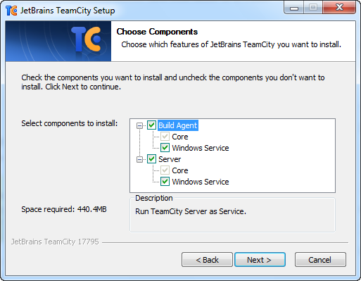

I picked port 8080 for the TeamCity server port, but feel free to pick any number that makes you happy.

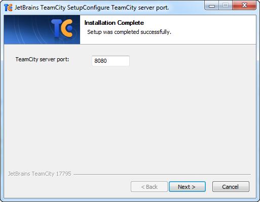

During the installation a dialog will pop up that allows you to edit the configuration of the build agent. Just leave the default values and click Save.

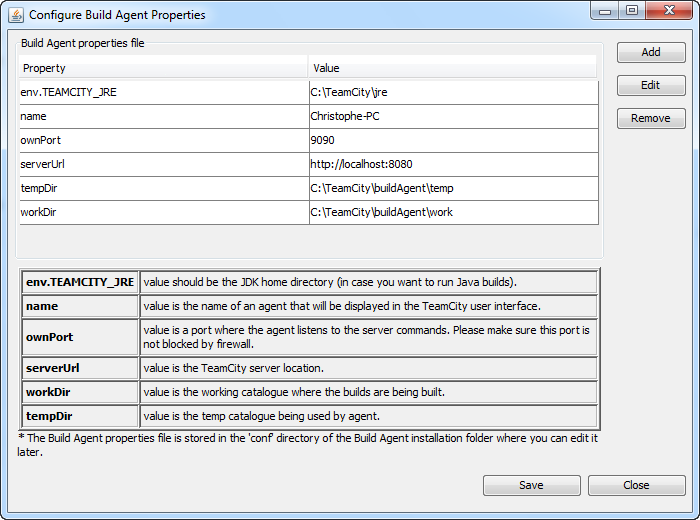

During the last phase of the installation process the wizard will ask you under which account you want to run the "Build Agent" and "TeamCity Server" services. I selected the System account and allowed the wizard to start them.

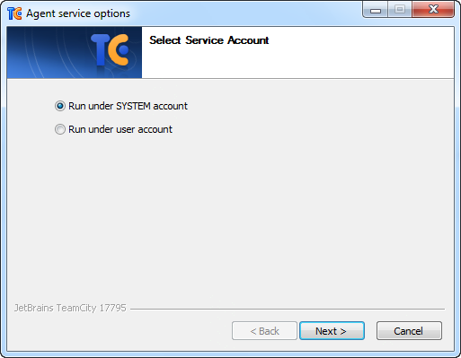

If you take a look at the directory (e.g.: c:\\teamcity\\buildagent\\) in which TeamCity installed the build agent you'll notice that it contains a plugins directory. After the installation this directory is empty, but the plugins will be downloaded after the installation.

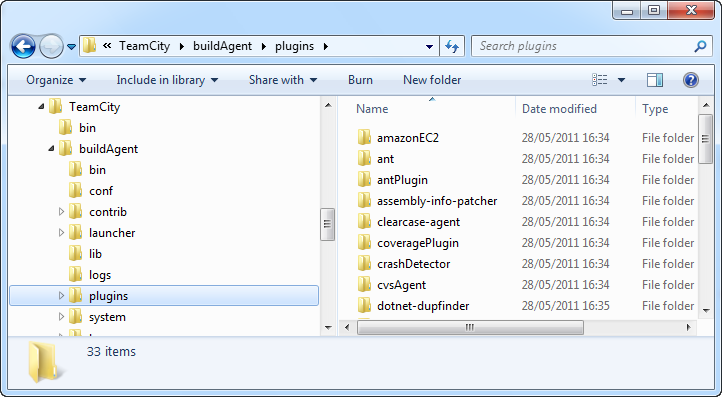

So be patient and allow the downloads to complete. Don't start the build agent service manually from the Services MMC snap-in, because this will stop the download of the plugins. As you might have guessed, I have no patience and spent some time figuring out why the build agent's plugins folder only contained one lonely plugin.

**Remark**: Make sure to allow the necessary Windows Firewall exceptions when asked (or turn if off all together).

## Administration

After you've installed TeamCity you can access its administration website. Since I installed it own my own laptop I need to navigate to [http://localhost:8080](http://localhost:8080). (Feel free to install it on a another computer / server). First you need to accept a license agreement, after which you must create an administrator account.

Once the administrator account has been created you'll be redirected to the home page.

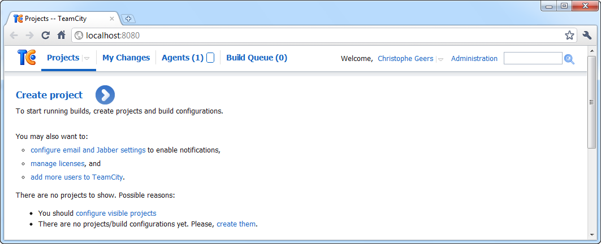

To start running builds you need to create at least one project and build configuration. Click on the Administration link in the upper right corner and then click on the "Add Project" link which is displayed just below the "Active Projects" tab. Name the project "People Finder" and click Create to add the new project.

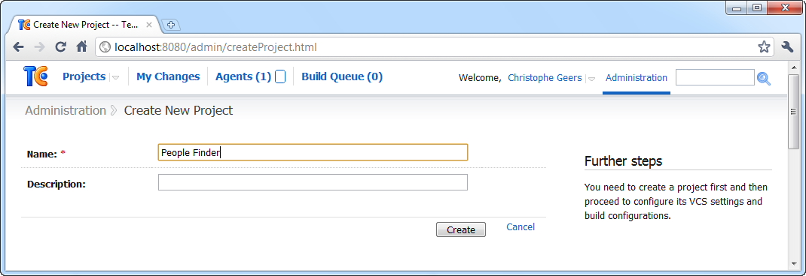

For this demo I'll be using a project called People Finder. This is just a simple console application which I wrote earlier this month. Check out the [NUnit & Moq article](https://github.com/geersch/NUnitMoq) to see how this application is structured. It's a very simple project, but it already contains a couple of unit tests written using the [NUnit](http://nunit.org/) and [Moq](http://code.google.com/p/moq/) frameworks.

## VCS Roots

Next you need to link the project to a VCS root. TeamCity supports multiple version control systems such as Team Foundation Service, Subversion, Mercurial, Git...etc.

Go back to the projects overview page in the administration section, click Edit next to the People Finder project and select the VCS Roots tab in the screen that is shown.

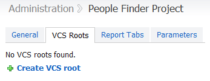

Click on the "Create VCS root" link and select the version control system of your choice. I have [CollabNet Subversion Edge 1.3.2](http://www.open.collab.net/downloads/subversion/) installed on my computer so I picked Subversion.

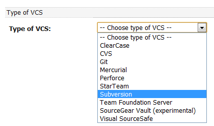

Depending on which VCS you select you may need to enter different data. For Subversion the only required data that I need to enter are a name for the VCS root, the URL to the trunk of the project and an account for Subversion so that TeamCity can access the repository.

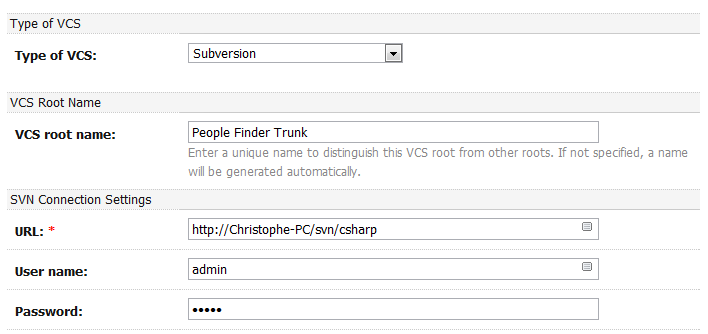

Once you've filled in the form click Save to link the VCS root to your project. The project is now registered in TeamCity and has been linked to a version control system.

## Build Configuration

After registering the project in TeamCity you need to create a build configuration for it. Go back to the projects overview page and click the "Create Build Configuration" link inside of box (div) that represents the People Finder project.

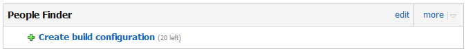

You need to fill in a couple of forms in order to create a build configuration. Let's quickly walk through them.

First you need to enter some general settings. Give the build configuration a name (e.g. Development Build), leave the rest of the fields set to their default values and click on the "VCS Settings" button.

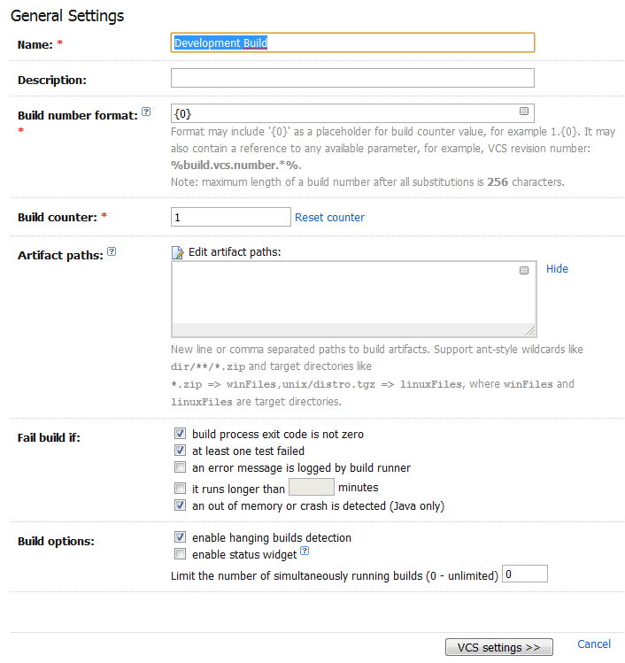

In the "Version Control Settings" form select the VCS root you created earlier and click on the "Add Build Step" button.

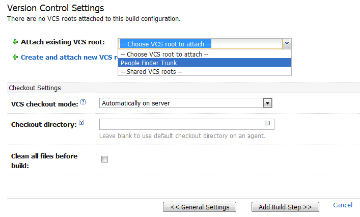

Now we need to instruct the build configuration which actions (or steps) it must undertake. For now we'll instruct it to compile the code using [MSBuild](http://msdn.microsoft.com/en-us/library/0k6kkbsd.aspx). Select MSBuild as the runner type, enter a name for the build step, specify the path for the solution (\*.sln) or the project file (\*.csproj) and choose the MSBuild version and run platform.

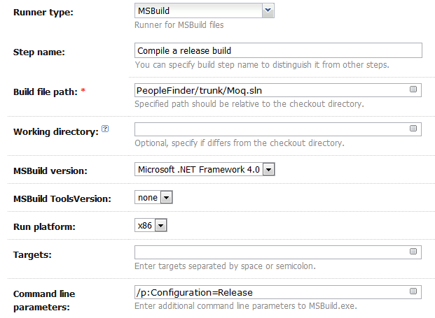

You can see that I specified an additional command line parameter for MSBuild. I used the following parameter:

- **/p:Configuration=Release**: Instructs MSBuild to compile a release build instead of a debug build.

[Feel free to add your own command line parameters](http://msdn.microsoft.com/en-us/library/ms164311.aspx).

Finally click Save to create the build configuration. If you return to the projects overview you'll see the new build configuration displayed below the People Finder project. Click "Run..." to compile it.

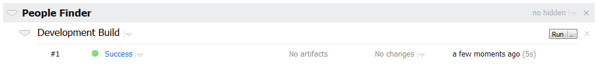

**Remark**: Make sure that you have the [Microsoft Windows SDK for Windows 7 and .NET Framework 4](http://www.microsoft.com/downloads/details.aspx?familyid=6b6c21d2-2006-4afa-9702-529fa782d63b) installed if Visual Studio 2010 is not installed on your build server.

## Build Trigger

I don't want to click "Run" each time I check in some code. This should happen automagically. No problem! We need to tweak the build configuration a bit. In the administration section go back to the projects overview page and click edit next to the build configuration.

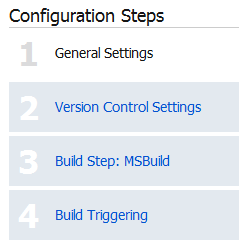

On the right side of the screen you should see a side bar called "Configuration Steps". Select the fourth step called "Build Triggering".

Build triggers are used to add builds to the queue when an event occurred (like VCS check-in) or periodically with some configurable interval.

Click on the "Add new trigger" link and select VCS Trigger. A VCS Trigger will add a build to the queue if a check-in is detected. Just select the "Use default value (60 seconds)" option or fill in a custom period and click the Save button to add the build trigger.

If you change some code and check in the changes you'll notice that TeamCity will automatically add a new build to the build agent's queue.

## NUnit Build Step

Almost done. We still need to tell TeamCity that it should run our unit tests. Time to edit the build configuration once more. This time select step 3 "Build Steps" and click "Add build step".

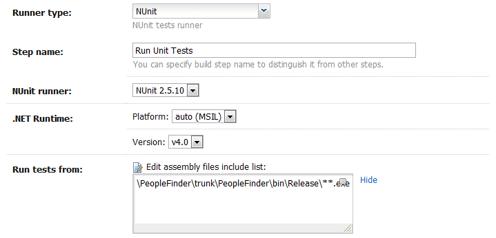

Choose NUnit for the runner type, enter a name for the build step, pick the correct NUnit version and select the desired .NET runtime. In the text area where it says "Run tests from" you need to enter the location of the assemblies (dll or exe) that contain the unit tests. In my case the console application itself contains the unit tests so I specified the location of the exe which is compiled by the first build step.

If you run the build configuration again, you'll notice that it now informs you how many tests passed and / or failed.

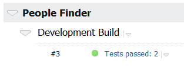

That's all she wrote. TeamCity is now configured to automatically compile the project and run the unit tests each time it detects a change to the source control repository. In the following parts of the series we'll explore how we can configure TeamCity to automatically deploy builds.
