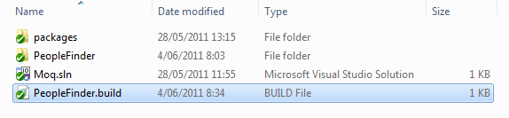
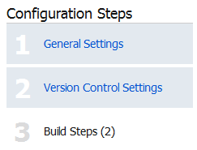
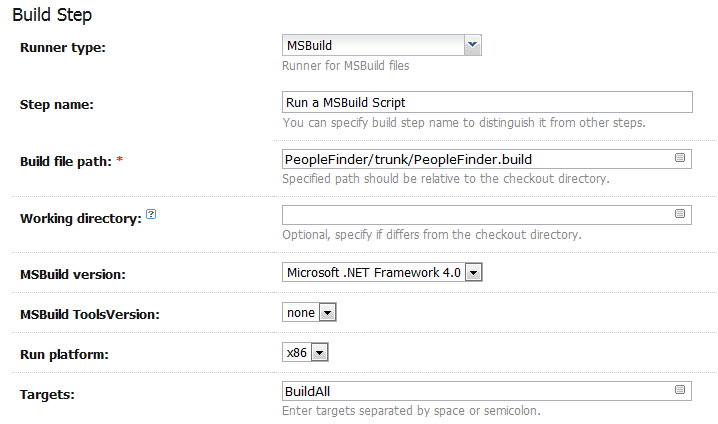
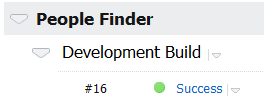
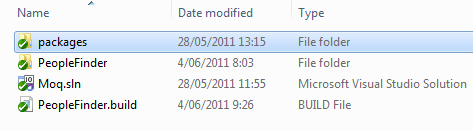
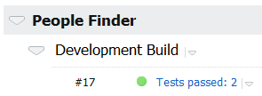

# Using a MSBuild Script in TeamCity

## Introduction

This post picks up where the previous post, [Running Unit Tests With TeamCity](../part-1/README.md), left off. If you haven't read it yet, read it first.

The first post in this series showed how you can run unit tests (using NUnit) in TeamCity by creating a build configuration and configuring two build steps, namely:

1. Compile the code using the MSBuild build runner
2. Run the unit tests using the NUnit build runner

This post shows how you can replace both of these steps by one single step which executes all of these actions using a [MSBuild script](<http://msdn.microsoft.com/en-us/library/wea2sca5(VS.90).aspx>).

## MSBuild Script

Let's start by creating a simple MSBuild script that allows us to compile our solution. I'm still using the same [sample application (PeopleFinder)](https://github.com/geersch/NUnitMoq) as in the first post of this series.

Create a new text file called "PeopleFinder.build" and save it in the directory that contains the solution file (\*.sln) of your project.



Open the file in notepad (or Visual Studio) and add the following contents to it:

```xml
<Project xmlns="http://schemas.microsoft.com/developer/msbuild/2003">
  <PropertyGroup>
    <WorkingFolder>$(MSBuildProjectDirectory)</WorkingFolder>
    <Configuration>Release</Configuration>
    <SolutionFile>Moq.sln</SolutionFile>
  </PropertyGroup>

  <Target Name="BuildAll" DependsOnTargets="Compile" />

  <Target Name="Compile">
    <Message Text="=== COMPILING $(Configuration) configuration ===" />
    <MSBuild Projects="$(SolutionFile)"
             Properties="Configuration=$(Configuration)" />
  </Target>
</Project>
```

Inside of the PropertyGroup node a few properties are defined:

- **WorkingFolder**: The $(MSBuildProjectDirectory) reserved property is the absolute path of the directory where the project file is located, for example, C:\\Projects\\PeopleFinder.
- **Configuration**: The type of build to compile (debug, release...etc.).
- **SolutionFile**: The name of the solution file (\*.sln).

You can also see that two targets are defined in the build script. A target contains a set of tasks for MSBuild to execute sequentially. The target called Compile specifies that MSBuild should compile the solution specified by the SolutionFile property using the configuration set by the Configuration property. In other words, MSBuild should compile a release build of the Moq.sln solution. The BuildAll target executes the Compile target. This will come in handy later on.

Make sure to check-in the build file!

## TeamCity

Now we need to configure our build configuration in TeamCity so that it executes the tasks defined in the MSBuild script. Go to the administration section of TeamCity and click edit next to your build configuration.

Go to step 3 (build steps) of the configuration steps.



Delete the second build step ("Run Unit Tests") which you created during the first post of this series. Next edit the first build step:

1. Rename the build step to "Run a MSBuild Script"
2. Point the "Build file path" to the MSBuild script (e.g. PeopleFinder/trunk/PeopleFinder.build)
3. Set the "Targets" property to "BuildAll"
4. Click Save



If you run the build configuration it will execute your MSBuild script.



But as you can see, no unit tests were executed! Let's fix this.

## Unit Tests

Time to edit the MSBuild script once more. Open it up in your favorite editor and alter it until it look like the one below:

```xml
<Project xmlns="http://schemas.microsoft.com/developer/msbuild/2003">
  <PropertyGroup>
    <WorkingFolder>$(MSBuildProjectDirectory)</WorkingFolder>
    <Configuration>Release</Configuration>
    <SolutionFile>Moq.sln</SolutionFile>
    <NUnitPath>$(WorkingFolder)\packages\NUnit.2.5.10.11092\tools</NUnitPath>
  </PropertyGroup>

  <Target Name="BuildAll" DependsOnTargets="Compile;Test" />

  <Target Name="Compile">
    <Message Text="=== COMPILING $(Configuration) configuration ===" />
    <MSBuild Projects="$(SolutionFile)"
             Properties="Configuration=$(Configuration)" />
  </Target>

  <Target Name="Test">
    <ItemGroup>
      <TestAssemblies
        Include="**\PeopleFinder.exe"
        Exclude="**\obj\**;**\packages\NUnit.2.5.10.11092\**" />
    </ItemGroup>

    <Message Text="=== RUNNING UNIT TESTS ==="/>
    <NUnit Assemblies="@(TestAssemblies)" ToolPath="$(NUnitPath)"
          DisableShadowCopy="true" />
  </Target>
</Project>
```

I added one new property called NUnitPath which points to the NUnit executable directory. I downloaded NUnit via [NuGet](http://www.hanselman.com/blog/IntroducingNuPackPackageManagementForNETAnotherPieceOfTheWebStack.aspx) so it's located in a folder called "packages" which resides at the same level as my solution file. I checked it into Subversion together with the rest of the solution.



Then I created a new target (Test) and informed the BuildAll target that it should first run the tasks defined in the Compile target followed by those of the Test target.

The Test target instructs NUnit where it can find the assemblies that contain the unit tests (Include) and the assemblies which it should ignore (Exlude). Then it simply instruct NUnit (NUnitPath) to run those unit tests.

**Remark**: NUnit needs to ignore its own unit tests otherwhise your builds will fail.

If you run the build configuration once more, you'll notice that the tests are executed again.



Voila, now your TeamCity build configuration only contains one single build step which executes all of the tasks defined in an MSBuild script. This script will come in handy in the following parts of this series as we can add additional tasks to it without the need to alter our TeamCity build configuration.
