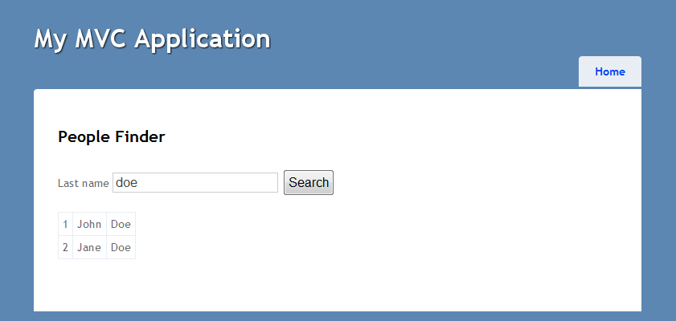
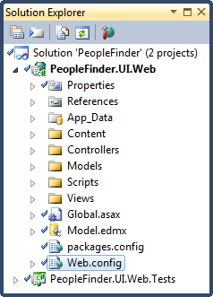
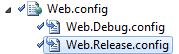
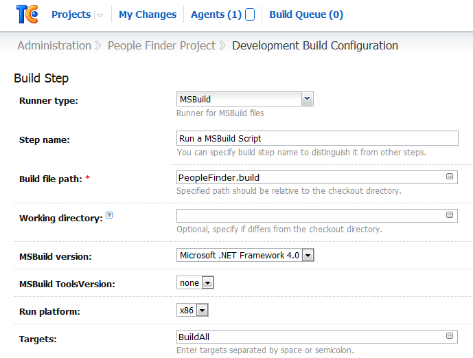
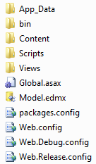
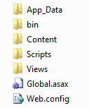

# Web.config Transformation Using TeamCity

## Introduction

In the previous parts of the _TeamCity series_ I discussed how you can configure the TeamCity [CI](http://en.wikipedia.org/wiki/Continuous_integration) build server to [run unit tests](../part-1/README.md) and how you can make this all happen using a [MSBuild script](..//part-2/README.md).

The end goal of this series is to arrive at a build configuration which we can use to automatically deploy an ASP.NET MVC web application. We want a reliable way of deploying an application to a new environment (staging, acceptance, production...etc.). Manually copying files, editing configuration files, synchronizing servers...is not a wise course.

You want to should avoid manual actions during deployment. Sure, you can get all the steps correct, but in the long run mistakes are unavoidable. And besides, doing all this stuff manually is just plain boring and tedious.

One of the first steps in deploying an ASP.NET / ASP.NET MVC application is to make sure its configuration file (Web.config) is transformed so it fits the environment in which the application will be running. Let's see how we can apply [Web.config transformation](http://msdn.microsoft.com/en-us/library/dd465318.aspx) using TeamCity.

## Demo Web Application

For testing purposes I created a small ASP.NET MVC 3 web application. The application contains a single web page which allows me to query a list of persons by their last name.



It contains a single (local) database which contains one lonely table, namely `[Person]`.

The solution in which this project is contained also contains a project to house the unit tests. It only contains one test (NUnit), which tests nothing in particular (Hey, it's a demo.).



This project was only created to demonstrate that we can create a build configuration which performs:

- Compilation
- Runs unit tests
- Transforms configuration files (Web.config)

## The Transformation

The development Web.config file contains a couple of items I want to replace when I create a release build via TeamCity, namely:

- The debug attribute of the [compilation element](http://msdn.microsoft.com/en-us/library/s10awwz0.aspx) must be removed. I want to compile release binaries instead of debug binaries.
- I want to replace the application settings.
- The connection string(s) must point to another database server, instead of my local development database.

A Web.config transformation file for the release build (Web.Release.config) is added to a new ASP.NET MVC project by default. You can add as many transformation files as there are configurations for your project (debug, release...etc.).



I added the following contents to the Web.Release.config transform file which specifies how the Web.config file should be changed when it is deployed. It's quite straightforward to read.

```xml
<?xml version="1.0"?>
<configuration xmlns:xdt="http://schemas.microsoft.com/XML-Document-Transform">
  <system.web>
    <compilation xdt:Transform="RemoveAttributes(debug)" />
  </system.web>

  <appSettings xdt:Transform="Replace">
    <add key="webpages:Version" value="2.0.0.0" />
    <add key="ClientValidationEnabled" value="false" />
    <add key="UnobtrusiveJavaScriptEnabled" value="false" />
  </appSettings>

  <connectionStrings>
    <add xdt:Transform="SetAttributes" xdt:Locator="Match(name)"
         name="DatabaseEntities"
         connectionString="The production connection string goes here." />
  </connectionStrings>
</configuration>
```

You can clearly see that it removes the debug attribute from the compilation element, replaces the appSettings node and replaces the connectionString attribute of the connection string named "DatabaseEntities".

More information on Web.config transformation syntax can be found here:

[http://msdn.microsoft.com/en-us/library/dd465326.aspx](http://msdn.microsoft.com/en-us/library/dd465326.aspx)

## Basic Build Configuration

Now that we have the sample project setup and the Web.Release.config has been created, we can commence to create a build configuration in TeamCity that automatically transforms the configuration.

Let's first setup the project and a basic build configuration that compiles a release build and runs our unit tests. To do so create a new build configuration in TeamCity which contains a single build step. I'll quickly go over this as this is explained in the previous two articles of this series.

- [Part 1: Running Unit Tests With TeamCity](../part-1/README.md)
- [Part 2: Using a MSBuild Script in TeamCity](../part-2/README.md)

This build step executes a [MSBuild script](<http://msdn.microsoft.com/en-us/library/wea2sca5(VS.90).aspx>). The contents of the MSBuild script are displayed below.

```xml
<Project xmlns="http://schemas.microsoft.com/developer/msbuild/2003">
  <PropertyGroup>
    <WorkingFolder>$(MSBuildProjectDirectory)</WorkingFolder>
    <Configuration>Release</Configuration>
    <SolutionFile>PeopleFinder.sln</SolutionFile>
    <NUnitPath>$(WorkingFolder)\packages\NUnit.2.5.10.11092\tools</NUnitPath>
  </PropertyGroup>

  <Target Name="BuildAll" DependsOnTargets="Compile;Test;" />

  <Target Name="Compile">
    <Message Text="=== COMPILING $(Configuration) configuration ===" />
    <MSBuild Projects="$(SolutionFile)"
             Properties="Configuration=$(Configuration)" />
  </Target>

  <Target Name="Test">
    <ItemGroup>
      <TestAssemblies
        Include="**\*.Tests.dll"
        Exclude="**\obj\**;**\packages\NUnit.2.5.10.11092\**" />
    </ItemGroup>

    <Message Text="=== RUNNING UNIT TESTS ==="/>
    <NUnit Assemblies="@(TestAssemblies)" ToolPath="$(NUnitPath)"
          DisableShadowCopy="true" />
  </Target>
</Project>
```

Make sure that your build step (runner type: MSBuild) executes the target "BuildAll". This target executes the targets Compile and Test. The Compile target creates a release build and the Test target executes the unit tests.



## Deploy Target

Let's add a new target to the MSBuild script called "Deploy". Append the target to the end of the "DependsOnTargets" attribute of the "BuildAll" target.

```xml
<Project xmlns="http://schemas.microsoft.com/developer/msbuild/2003">
  <PropertyGroup>
    <!-- ...other properties... -->
    <DeployPath>C:\Projects\build\PeopleFinder</DeployPath>
  </PropertyGroup>

  <Target Name="BuildAll" DependsOnTargets="Compile;Test;Deploy;" />

  <!-- ...other targets... -->
  <Target Name="Deploy">
     <Message Text="=== DEPLOY LATEST BUILD to $(DeployPath) ===" />

     <RemoveDir Directories="$((DeployPath)" />
     <MakeDir Directories="$(DeployPath)"/>

     <ItemGroup>
       <DeployWebFiles Include="PeopleFinder.UI.Web\**\*.*"
                       Exclude="**\*.cs;**\*.csproj;**\*.user;**\obj\**;**\.svn\**;**\*.pdb;" />
     </ItemGroup>

    <Copy SourceFiles="@(DeployWebFiles)"
          DestinationFiles="@(DeployWebFiles->'$(DeployPath)\%(RecursiveDir)%(Filename)%(Extension)')" />
  </Target>
</Project>
```

This new target is responsible for copying the compiled output to a new location ($DeployPath). After you check in the new build file and run the build configuration the Deploy target will copy the compiled output to the directory specified by the $DeployPath property.



Hrmm, there are still some files in there we are not interested in. Let's expand the Exclude attribute of the DeployWebFiles item group.

```xml
DeployWebFiles Include="PeopleFinder.UI.Web\**\*.*"
Exclude="**\*.cs;**\*.csproj;**\*.user;**\obj\**;
         **\.svn\**;**\*.pdb;**\*.edmx;**\packages.config;**\Web.*.config" />
```



That's better.

## Transform Target

At the moment the MSBuild script compiles the project, runs the unit tests and copies the output to a separate directory ($DeployPath). If you open the Web.config file which resides in this directory you'll notice that it is a copy of the development version. The release transformation hasn't been applied yet. Time to fix this.

To do so, we need to add another target to the script. For readability's sake, I introduced some extra line breaks.

```xml
<Project xmlns="http://schemas.microsoft.com/developer/msbuild/2003">
  <PropertyGroup>
    <!-- ...other properties... -->
    <TransformInputFile>PeopleFinder.UI.Web\Web.config</TransformInputFile>
    <TransformFile>PeopleFinder.UI.Web\Web.$(Configuration).config</TransformFile>
    <TransformOutputFile>$(DeployPath)\Web.config</TransformOutputFile>
  </PropertyGroup>

  <UsingTask TaskName="TransformXml"
             AssemblyFile="$(MSBuildExtensionsPath)\Microsoft\
                           VisualStudio\v10.0\Web\
                           Microsoft.Web.Publishing.Tasks.dll"/>

  <Target Name="BuildAll" DependsOnTargets="Compile;Test;Deploy;Transform" />

  <!-- ...other targets... -->
  <Target Name="Transform">
     <Message Text="=== TRANSFER THE CONFIGURATION FILE ===" />
     <TransformXml Source="$(TransformInputFile)"
                   Transform="$(TransformFile)"
                   Destination="$(TransformOutputFile)" />
  </Target>
</Project>
```

The BuildAll target now executes the targets Compile, Test, Deploy & Transform. After the output has been copied to the $(DeployPath) the Transform target applies the release (Web.$(Configuration).config) transformation to the Web.config file.

If run the build configuration now you'll notice that the Web.config has successfully been updated and now contains the correct settings. No more boring manual editing.

**Remark**: Please note that you need to add an [UsingTask element](http://msdn.microsoft.com/en-us/library/t41tzex2.aspx) to the MSBuild script to reference the TransformXml task whose implementation is contained in the Microsoft.Web.Publishing.Task.dll assembly.

That wraps it up for applying Web.config transformations via TeamCity using a MSBuild script.
